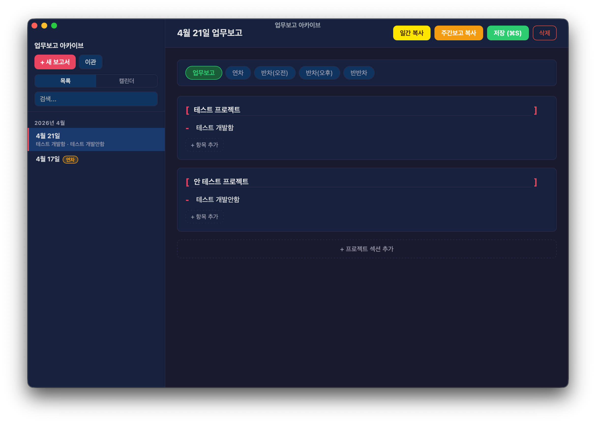
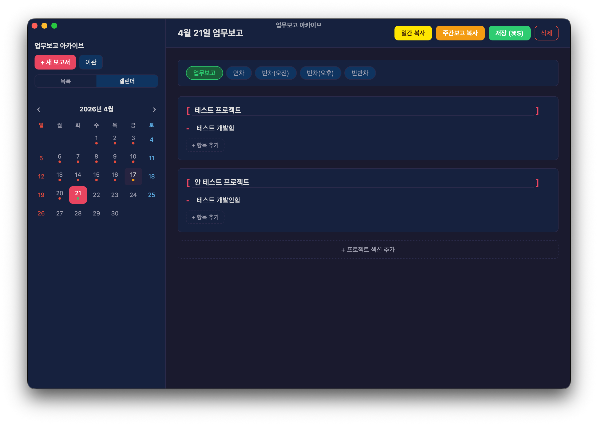
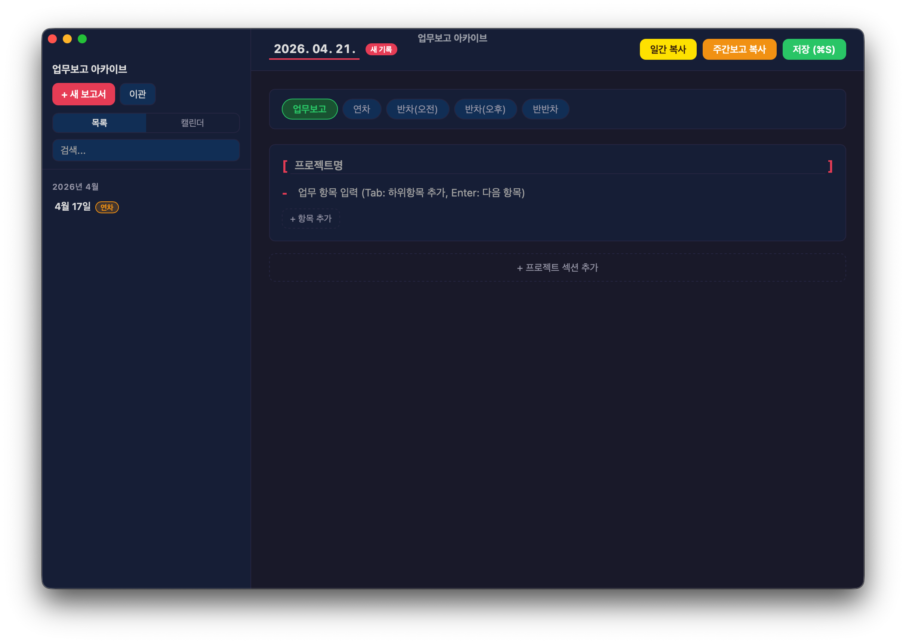
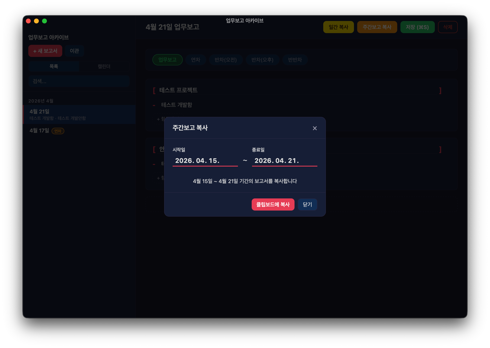

# 업무보고 아카이브

매일 카카오톡으로 전송하는 업무보고를 체계적으로 작성·보관·검색할 수 있는 데스크톱 앱입니다.



---

## 기획 의도

팀에서 매일 카카오톡으로 업무보고를 공유하다 보면 누적된 기록을 다시 찾아보기가 어렵습니다.  
특정 날짜에 어떤 업무를 했는지, 어떤 프로젝트를 얼마나 진행했는지 돌아보려면 카카오톡 채팅 기록을 일일이 스크롤해야 합니다.

**업무보고 아카이브**는 이 문제를 해결하기 위해 만들었습니다.

- 기존에 카카오톡으로 작성했던 보고서를 그대로 붙여넣어 한 번에 이관
- 이후로는 앱에서 직접 작성하고, 카카오톡 형식으로 바로 복사
- 키워드로 과거 업무 내용 빠르게 검색
- 연차·반차 기록도 함께 관리

---

## 주요 기능

| 기능 | 설명 |
|------|------|
| 📝 보고서 작성 | 프로젝트별 섹션, 항목·하위항목 구조로 작성 |
| 📋 카카오톡 복사 | 일간 / 주간 보고서를 카카오톡 형식으로 클립보드에 복사 |
| 📅 캘린더 뷰 | 월별 달력에서 보고서 현황 한눈에 파악 (녹색: 업무보고, 주황: 휴가, 빨강: 누락) |
| 🔍 전문 검색 | 키워드로 전체 보고서 내용 검색 |
| 🏖️ 휴가 기록 | 연차·반차(오전/오후)·반반차 기록 |
| 📥 텍스트 이관 | 기존 카카오톡 업무보고 텍스트를 붙여넣어 일괄 이관 |
| 💾 백업 / 복원 | 전체 데이터를 JSON 파일로 백업하고 복원 |

---

## 스크린샷

<table>
  <tr>
    <td><br/><sub>메인 화면 — 목록 + 보고서</sub></td>
    <td><br/><sub>캘린더 뷰</sub></td>
  </tr>
  <tr>
    <td><br/><sub>보고서 작성</sub></td>
    <td><br/><sub>주간보고 기간 선택</sub></td>
  </tr>
</table>

---

## 설치

### macOS (Apple Silicon)

1. [Releases](https://github.com/w34538y/work-report/releases) 에서 `업무보고 아카이브_x.x.x_aarch64.dmg` 다운로드
2. DMG를 열고 앱을 **Applications** 폴더로 드래그
3. 처음 실행 시 미서명 앱 경고가 뜨면 **오른쪽 클릭 → 열기** 선택

> 또는 터미널에서 격리 속성 제거:
> ```bash
> xattr -dr com.apple.quarantine /Applications/업무보고\ 아카이브.app
> ```

### Windows

1. [Releases](https://github.com/w34538y/work-report/releases) 에서 `.exe` 설치 파일 다운로드
2. 설치 파일 실행
3. "Windows의 PC 보호" 경고 시 **추가 정보 → 실행** 클릭

---

## 사용법

### 보고서 작성

1. 왼쪽 사이드바에서 **+ 새 보고서** 클릭
2. 날짜 확인 (누락된 날짜 작성 시 날짜 수정 가능)
3. **[프로젝트명]** 입력 후 업무 항목 작성
   - `Tab` → 하위항목 추가
   - `Enter` → 다음 항목 추가
4. **저장 (⌘S / Ctrl+S)**

### 카카오톡 형식으로 복사

- **일간 복사** — 해당 날짜 보고서를 카카오톡 형식으로 복사
- **주간보고 복사** — 기간을 선택하여 해당 기간의 보고서 전체를 복사

복사 형식 예시:
```
[4월 21일 업무보고]
[프로젝트명]
- 업무 항목
    - 하위 항목
```

### 기존 보고서 이관

**이관** 버튼 → **텍스트 이관** 탭에서 기존 카카오톡 업무보고 텍스트를 붙여넣으면 자동으로 파싱하여 저장합니다.

지원 형식:
```
[4월 15일 업무보고]
[프로젝트명]
- 업무항목
    - 하위항목

[4월 16일 업무보고]
...
```

- 연도가 바뀌는 시점(12월 → 1월)은 자동으로 감지하여 처리합니다.

### 캘린더 뷰

사이드바 상단의 **캘린더** 탭에서 월별 보고서 현황을 확인할 수 있습니다.

| 표시 | 의미 |
|------|------|
| 🟢 초록 점 | 업무보고 있음 |
| 🟠 주황 점 | 휴가 기록 (연차/반차) |
| 🔴 빨간 점 | 과거 평일 중 기록 없음 |

### 백업 & 복원

**이관** 버튼 → **백업 / 복원** 탭

- **백업 저장** — 전체 보고서를 JSON 파일로 내보냄
- **파일 선택** — 백업 파일에서 복원 (기존 데이터와 병합)

---

## 데이터 저장 위치

보고서는 각 날짜별 JSON 파일로 저장됩니다.

- **macOS**: `~/Library/Application Support/com.workreport.archive/reports/`
- **Windows**: `C:\Users\{사용자}\AppData\Roaming\com.workreport.archive\reports\`

---

## 소스에서 빌드

```bash
# 의존성 설치 (Rust, Node.js 필요)
npm install

# 개발 모드 실행
npm run tauri:dev

# 배포용 빌드
npm run tauri:build
```

빌드 결과물: `src-tauri/target/release/bundle/`

---

## 기술 스택

- **프론트엔드**: React 19 + TypeScript + Vite
- **백엔드**: Rust + Tauri 2
- **데이터 저장**: JSON 파일 (날짜별)
- **패키징**: macOS DMG / Windows NSIS
